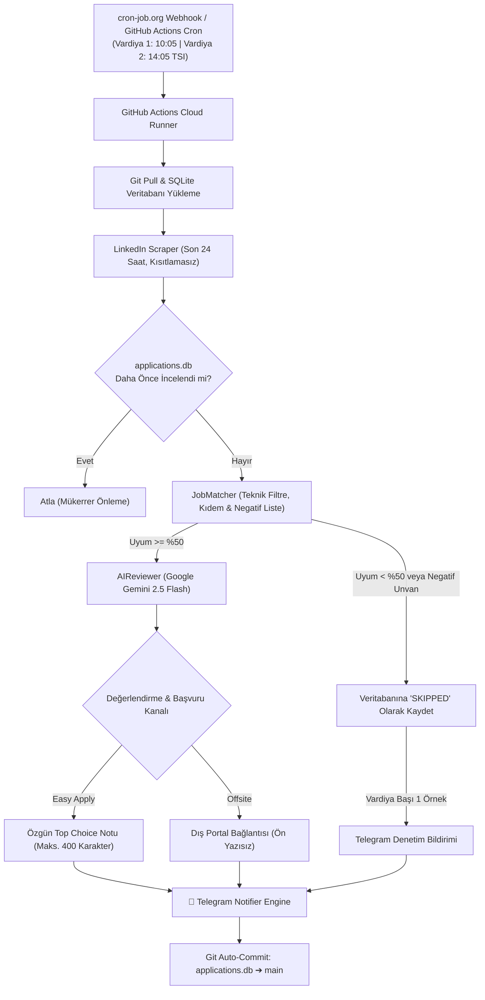

# 🚀 AI Career Copilot — Otonom İş Arama & Başvuru Asistanı

[](https://python.org)
[](https://aistudio.google.com/)
[](https://core.telegram.org/bots)
[](https://github.com)
[](https://cron-job.org)
[](#)

> **AI Career Copilot**, iş arama sürecini uçtan uca otomatikleştiren, **Google Gemini** bilişsel motoruyla güçlendirilmiş, sıfır halüsinasyon garantili ve bulut üzerinde 7/24 otonom çalışan yeni nesil bir kariyer asistanıdır.

Bilgisayarınız kapalıyken bile LinkedIn üzerindeki tüm güncel ilanları tarar, adayın gerçek mühendislik projeleriyle (CoupleOS, 42 İstanbul C/C++ Sistem Mimarisi vb.) semantik uyum analizi yapar, LinkedIn mobil Kolay Başvuru (Easy Apply) formuna özel **maksimum 400 karakterlik insan yazımı başvuru notları** üretir ve doğrudan Telegram üzerinden tek dokunuşla başvurabileceğiniz zengin kartlar iletir.

---

## 🌟 Öne Çıkan Yetenekler

* **🧠 Tam Metin Gemini Semantik İncelemesi:** İlan açıklamalarının sorumluluklar ve gereksinimler bölümlerini (6.000 karaktere kadar) eksiksiz okur. Ömer Faruk Gökdaş'ın master profilindeki gerçek deneyimleri ile eşleştirir.
* **💬 LinkedIn Mobil Uyumlu Kolay Başvuru Notu (0-400 Karakter):**
  * LinkedIn mobil uygulamasındaki *"Bu ilanı en iyi seçenek olarak işaretle (İsteğe bağlı) - Başvurunuzla birlikte bir mesaj ekleyin (0/400)"* alanına özel üretilir.
  * Klasik "Sayın Yetkili / Saygılarımla" gibi hantal e-posta kalıplarından arındırılmış, doğrudan teknik katma değere odaklanan, yapay zeka kokmayan samimi mühendis dili.
  * Python seviyesinde kesin **$\le$ 400 karakter** uzunluk garantisi.
* **🌐 Şirket Portalı / Dış Başvurular İçin Temiz Ayrım:** Dış şirket portallarına yönlendiren ilanlar için gereksiz ön yazı üretilmez; sadece doğrudan başvuru butonu ve 92 puanlık Master ATS CV paketi sunulur.
* **💾 Git Tabanlı Kalıcı Veritabanı Hafızası:**
  * `applications.db` SQLite veritabanı, GitHub Actions her çalıştığında otomatik olarak repoya commit edilir (`[skip ci]`).
  * Bulut sunucuları kapansa bile daha önce incelenen, elenen veya önerilen hiçbir ilan asla unutulmaz ve mükerrer bildirim gönderilmez.
* **⏰ 2 Vardiyalı & Kısıtlamasız Son 24 Saat Taraması:**
  * **Vardiya 1 (10:05 TSI):** Genç Yetenek, Staj, C/C++ & Sistem Programlama, Junior Backend
  * **Vardiya 2 (14:05 TSI):** Frontend (React/TypeScript), Mobil (React Native), AI Engineer & IT Destek
  * `jobs_per_query: null` ayarı ve 20 sayfalık (500 ilana kadar) arama tavanı sayesinde son 24 saatteki tüm ilanlar eksiksiz incelenir; yapay sınır yoktur.
* **⏱️ Harici Tetikleyici (cron-job.org) ile Dakik Çalışma:** GitHub Actions'ın ücretsiz cron kuyruk gecikmelerini aşmak için cron-job.org üzerinden hassas dakikada webhook tetiklemesi yapılır.
* **🔍 Şeffaf Denetim Mekanizması:** Her vardiyada filtrenin doğru çalıştığını teyit edebilmeniz için elenen ilk ilanın gerekçesi (`🚫 [ÖRNEK ELENEN İLAN — TEST/DENETİM]`) Telegram'a iletilir.

---

## 🏗️ Sistem Mimarisi



---

## 📂 Proje Dizin Yapısı

```text
├── .github/workflows/
│   └── daily_pipeline.yml       # 2 vardiyalı GitHub Actions iş akışı + DB Git commit adımı
├── config/
│   ├── master_profile.yaml      # Adayın tek gerçeklik kaynağı (%100 doğrulanmış portföy & yetenekler)
│   ├── application_rules.yaml   # Eşleşme kuralları, kıdem ve öncelik tanımları
│   ├── notifications.yaml       # Telegram bildirim şablonları ve format ayarları
│   └── search_criteria.yaml     # 2 vardiyaya paylaştırılmış 12 odaklı arama sorgusu
├── core/
│   ├── ai_reviewer.py           # Gemini semantik analizi ve 400 karakterlik Easy Apply not üretimi
│   ├── db.py                    # SQLite bağlantı yönetimli ve çift kayıt önleyici DB motoru
│   ├── matcher.py               # Negatif unvan filtresi, C++ / TypeScript regex ve ön puanlama
│   ├── notifier.py              # Zengin Telegram HTML kartları, butonlar ve istatistik özeti
│   ├── scraper.py               # LinkedIn konuk API'si üzerinden sayfalama ve Easy Apply tespiti
│   └── builder.py               # Master ATS CV eşleme motoru
├── source_resume/
│   └── Omer_Faruk_Gokdas_CV_Master_ATS.pdf  # 92 puanlık doğrulanmış tek sayfa ATS CV
├── tests/
│   ├── test_system.py           # Sistem temel bileşen testleri
│   └── test_redesign.py         # 2 vardiya, 400 karakter not ve filtreleme birim testleri
├── applications.db              # Canlı takip veritabanı (otomatik commit edilir)
├── run_automation.py            # Ana çalıştırma, CLI parametreleri ve vardiya orkestratörü
├── requirements.txt             # Python bağımlılıkları
└── README.md                    # Proje dokümantasyonu
```

---

## 🎯 2 Vardiyalı Arama Stratejisi

Arama sorguları gereksiz örtüşmelerden arındırılarak 12 yüksek hedefli sorguya indirgenmiş ve 2 ana dilime paylaştırılmıştır:

| Dilim | Çalışma Saati (TSI) | Kapsanan Pozisyonlar | Odak Alanı |
| :--- | :--- | :--- | :--- |
| **Vardiya 1** | **10:05** | `Software Engineering Intern`<br>`Genç Yetenek Yazılım`<br>`Junior Software Engineer`<br>`Junior C++ Developer`<br>`C++ Developer`<br>`Junior Backend Developer` | Staj, Genç Yetenek, C/C++ Sistem Mühendisliği, Backend |
| **Vardiya 2** | **14:05** | `Junior Frontend Developer`<br>`TypeScript Developer`<br>`React Native Developer`<br>`Junior AI Engineer`<br>`AI Developer`<br>`IT Support Specialist` | Web (React/TS), Mobil (React Native), Yapay Zeka & IT Destek |

---

## 📱 Telegram Bildirim Formatı

Sistem Telegram üzerinden kullanıcıyı gereksiz bilgiyle boğmaz; doğrudan aksiyon aldırır:

1. **Kolay Başvuru (Easy Apply) Kartı:**
   * Uyum Puanı, Dil (TR/EN), Öne Çıkarılan Proje.
   * `💬 LinkedIn Başvuru Mesajı (Top Choice / 0-400 Karakter — Dokun Kopyala)`: Telefonda dokunulduğunda panoya kopyalanan hazır metin.
   * `[ 🚀 ⚡ Kolay Başvur (LinkedIn) ]` butonu.
2. **Dış Başvuru Kartı:**
   * Ön yazı kalabalığı olmadan doğrudan `[ 🚀 🌐 Şirket Portalında Başvur ]` butonu.
3. **Denetim Kartı:**
   * `🚫 [ÖRNEK ELENEN İLAN — TEST/DENETİM]` ile botun hangi ilanları neden elediğini gösteren şeffaf geri bildirim.
4. **Vardiya Özeti:**
   * Taranan yeni ilan, uygun bulunan ve elenen ilan sayıları.

---

## ⚡ Hızlı Başlangıç & Kurulum

### 1. Depoyu Klonlayın ve Bağımlılıkları Yükleyin

```bash
git clone https://github.com/omergokdass/ai-career-copilot.git
cd ai-career-copilot
python -m pip install -r requirements.txt
```

### 2. Ortam Değişkenlerini Ayarlayın

`.env` dosyanızı oluşturup API anahtarlarınızı tanımlayın:

```env
GEMINI_API_KEY=AIzaSy...SizinGeminiAnahtariniz
GEMINI_MODEL=gemini-2.5-flash

TELEGRAM_BOT_TOKEN=123456789:ABC...BotTokeniniz
TELEGRAM_CHAT_ID=6865745103
TELEGRAM_ENABLED=true
```

### 3. Yerel Test ve Çalıştırma

```bash
# Geçerli saate göre ilgili vardiyayı çalıştırır (10:00-13:00 -> Vardiya 1, 13:00+ -> Vardiya 2)
python run_automation.py

# Belirli bir vardiyayı elle zorlayarak çalıştırmak için:
python run_automation.py --shift 1 --force
python run_automation.py --shift 2 --force

# Tüm kategorileri hemen taramak için:
python run_automation.py --force --all
```

---

## 🤖 Bulut Otomasyonu (GitHub Actions + cron-job.org)

Sistem tamamen sunucusuz ve ücretsiz olarak bulutta çalışacak şekilde tasarlanmıştır:

1. **GitHub Secrets:** Deponuzda **Settings ➔ Secrets and variables ➔ Actions** bölümüne şunları ekleyin:
   * `GEMINI_API_KEY`
   * `TELEGRAM_BOT_TOKEN`
   * `TELEGRAM_CHAT_ID`
2. **GitHub Personal Access Token (PAT):**
   * GitHub Actions'ın `workflow_dispatch` API'sini dışarıdan tetikleyebilmesi için `repo` yetkisine sahip bir Fine-grained veya Classic Personal Access Token alın.
3. **cron-job.org Kurulumu (Gecikmesiz Tetikleme):**
   * **URL:** `https://api.github.com/repos/omergokdass/ai-career-copilot/actions/workflows/daily_pipeline.yml/dispatches`
   * **Method:** `POST`
   * **Headers:**
     * `Accept: application/vnd.github+json`
     * `Authorization: Bearer <GITHUB_PAT_TOKEN>`
     * `User-Agent: cron-job-org`
   * **Body (Vardiya 1 için 10:05 TSI):** `{"ref": "main", "inputs": {"shift": "1"}}`
   * **Body (Vardiya 2 için 14:05 TSI):** `{"ref": "main", "inputs": {"shift": "2"}}`

---

## 🧪 Testler

Sistem mimarisindeki 14 birim testin tamamı sıfır hata ile çalışır:

```bash
python -m unittest discover tests
```

---

## 👤 Geliştirici

**Ömer Faruk Gökdaş**  
* Nişantaşı Üniversitesi — Yazılım Mühendisliği
* 42 İstanbul (Ecole 42) — Sistem Programlama
* LinkedIn: [linkedin.com/in/omergokdass](https://linkedin.com/in/omergokdass)
* GitHub: [github.com/omergokdass](https://github.com/omergokdass)
* Web: [omergokdass.github.io](https://omergokdass.github.io)
