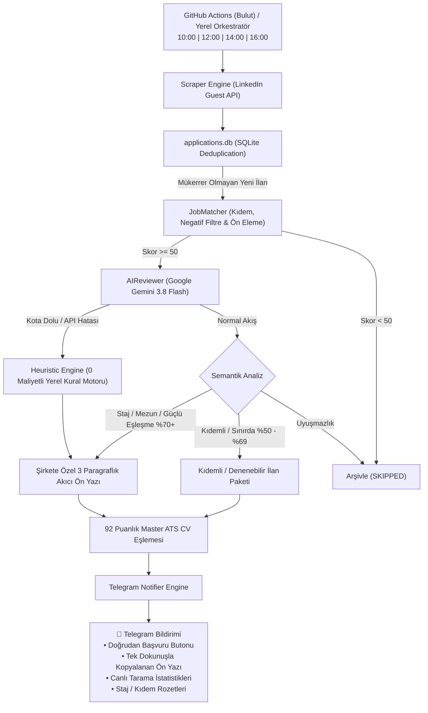

# 🚀 AI Career Copilot — Autonomous Job Hunter & Application Engine

[](https://python.org)
[](https://aistudio.google.com/)
[](https://core.telegram.org/bots)
[](https://github.com)
[](#)
[](#)

> **AI Career Copilot**, iş arama ve başvuru sürecini uçtan uca otomatikleştiren, **Google Gemini 3.8 Flash** bilişsel motoru ile güçlendirilmiş, sıfır halüsinasyon garantili otonom bir kariyer asistanıdır.

LinkedIn ve kurumsal şirket portallarındaki açık pozisyonları sürekli tarar, adayın gerçek mühendislik projeleriyle semantik uyum puanı hesaplar, her şirket için akıcı, doğal ve insan yazımı 3 paragraflık ön yazılar (Cover Letter) üretir ve kullanıcının telefonuna **tek dokunuşla başvuru yapabileceği zengin Telegram kartları** iletir.

---

## 🌟 Öne Çıkan Özellikler

* **🧠 Google Gemini 3.8 Flash Bilişsel Motoru:** İlan metinlerini derinlemesine analiz ederek pozisyonun gerçek beklentilerini adayın doğrulanmış yetenek havuzuyla (CoupleOS, 42 İstanbul C/C++ Sistem Programlama, branda.ist, NishChat) kıyaslar ve semantik uyum puanı üretir.
* **✍️ Doğal, Akıcı & İnsan Yazımı Ön Yazılar:** Yapay zeka klişesi kokan madde imleri (`- **...**`) yerine, adayın gerçek projelerindeki teknik zorlukları ve çözümleri hikayeleştiren **3 paragraflık profesyonel kurumsal ön yazılar** üretir.
* **🛡️ %100 Sıfır Halüsinasyon İlkesi:** Adayın master profilinde yer almayan hiçbir teknoloji veya şişirilmiş deneyim (Spring Boot, Redis, AWS vb.) yapay zeka tarafından uydurulamaz.
* **📱 Zengin Telegram Copilot Arayüzü:**
  * **İnteraktif Başvuru Düğmeleri:** `[ 🚀 ⚡ Kolay Başvur (LinkedIn) ]` veya `[ 🚀 🌐 Şirket Portalında Başvur ]` butonları ile ilana tek tıkla geçiş.
  * **Tek Dokunuşla Kopyalama (`<code>`):** Telefonda ön yazıya dokunulduğu an metin panoya kopyalanır.
  * **Özel Fırsat Rozetleri:** Genç yetenek ve staj programları için `🎓 GENÇ YETENEK / STAJ FIRSATI`, yüksek deneyim isteyen ilanlar için `💼 KIDEMLİ / DENENEBİLİR İLAN` etiketleri.
  * **Canlı İlerleme Sayacı:** Her bildirimde o an taranan ve uygun bulunan ilan sayıları dinamik aktarılır.
* **🛑 4 Kademeli Güvenlik Kalkanı & Devre Kesici (Circuit Breaker):**
  * **Sıfır Fatura Riski:** Google AI Studio ücretsiz katmanında çalışır.
  * **Vardiya Başı Kota Kilidi:** Tek vardiyada maksimum 15 AI çağrısı yapılabilir; kota dolduğunda 0 maliyetli yerel motor devreye girer.
  * **Otomatik Devre Kesici:** Üst üste 2 hata alındığında API çağrıları kilitlenerek sonsuz döngü ve kota israfı önlenir.
  * **10 Dakika Hard Timeout:** GitHub Actions 10 dakikayı geçerse işlemi otomatik durdurur.
* **⏰ 4 Vardiyalı Akıllı Dağıtım:** Türkiye saatine (UTC+3) göre optimize edilmiş 4 ana zaman diliminde (10:00, 12:00, 14:00, 16:00) çalışarak LinkedIn rate-limit'lerini tamamen bypass eder.
* **🎯 Kesin Kolay Başvuru (Easy Apply) Tespiti:** Sayfa metinlerine değil, LinkedIn DOM elementlerine (`apply-link-onsite`, `guest-to-member-job-apply`) bakarak LinkedIn içi başvuruları ve dış şirket portallarını %100 doğrulukla ayırt eder.
* **📄 92 Puanlık Master ATS CV Eşlemesi:** Uluslararası ATS standartlarında optimize edilmiş tek sayfa A4 PDF CV otomatik olarak başvuru paketine eklenir.

---

## 🏗️ Sistem Mimarisi



---

## 📂 Proje Dizin Yapısı

```text
├── .github/workflows/
│   └── daily_pipeline.yml       # 4 vardiyalı otomatik GitHub Actions cron iş akışı (10 dk timeout)
├── config/
│   ├── master_profile.yaml      # Adayın tek gerçeklik kaynağı (%100 doğrulanmış portföy & CoupleOS)
│   ├── application_rules.yaml   # Güvenlik ve başvuru kuralları
│   ├── notifications.yaml       # Telegram bildirim parametreleri
│   └── search_criteria.yaml     # 6 ana kategoride 31+ arama sorgusu
├── core/
│   ├── ai_reviewer.py           # Gemini 3.8 Flash, devre kesici (circuit breaker) ve ön yazı motoru
│   ├── db.py                    # SQLite bağlantı yönetimli başvuru takip veritabanı
│   ├── matcher.py               # Negatif filtre, kıdem tespiti ve matematiksel puanlayıcı
│   ├── notifier.py              # Zengin Telegram HTML, inline buton ve kopyalama motoru
│   ├── scraper.py               # LinkedIn parametreli sayfalama ve Easy Apply tespitçisi
│   └── builder.py               # ATS CV ve ön yazı derleyici
├── source_resume/
│   └── Omer_Faruk_Gokdas_CV_Master_ATS.pdf  # 92 puanlık doğrulanmış ana ATS CV
├── tests/
│   └── test_system.py           # 10 adet %100 geçen kapsamlı birim test paketi
├── run_automation.py            # Ana çalıştırma, vardiya ve CLI orkestrasyon motoru
├── requirements.txt             # Python kütüphane bağımlılıkları
├── .env.example                 # Ortam değişkenleri şablonu
└── README.md                    # Dokümantasyon
```

---

## ⚡ Hızlı Başlangıç

### 1. Depoyu Klonlayın ve Bağımlılıkları Yükleyin

```bash
git clone https://github.com/omergokdass/ai-career-copilot.git
cd ai-career-copilot
python -m pip install -r requirements.txt
```

### 2. Ortam Değişkenlerini Ayarlayın

`.env.example` dosyasını `.env` olarak kopyalayın:

```bash
cp .env.example .env
```

`.env` dosyasını açıp API anahtarlarınızı girin:

```env
GEMINI_API_KEY=AIzaSy...SizinGeminiAnahtariniz
GEMINI_MODEL=gemini-3.8-flash
MAX_AI_CALLS_PER_RUN=15

TELEGRAM_BOT_TOKEN=123456789:ABC...BotTokeniniz
TELEGRAM_CHAT_ID=6865745103
TELEGRAM_ENABLED=true
```

### 3. Çalıştırma Seçenekleri

```bash
# Otomatik saate göre geçerli vardiyayı çalıştır
python run_automation.py

# Tüm kategorileri hemen taramak için (Force mode)
python run_automation.py --force --all

# Geçmişe dönük geniş tarama (İlk kurulum havuz oluşturma)
python run_automation.py --all --wide --force

# Belirli bir vardiyayı elle çalıştırma (1: Genç Yetenek/AI, 2: C++, 3: Backend, 4: Frontend/IT)
python run_automation.py --shift 1 --force
```

---

## 🤖 GitHub Actions Otomasyonu (Bulutta 7/24)

Sistem, bilgisayarınız kapalıyken bile GitHub sunucularında her gün Türkiye saatiyle **10:00, 12:00, 14:00 ve 16:00'da** otomatik olarak çalışır.

GitHub deponuzda **Settings ➔ Secrets and variables ➔ Actions** sekmesine şu 3 secret'ı eklemeniz yeterlidir:
1. `GEMINI_API_KEY` (Google AI Studio)
2. `TELEGRAM_BOT_TOKEN` (BotFather)
3. `TELEGRAM_CHAT_ID` (Telegram kullanıcı ID)

---

## 🧪 Testler

Sistemdeki 10 birim testin tamamı sıfır sızıntı ve tam koruma garantisiyle çalışır:

```bash
python -m unittest discover tests
```

---

## 👤 Geliştirici ve İletişim

**Ömer Faruk Gökdaş**  
* Nişantaşı Üniversitesi — Yazılım Mühendisliği
* 42 İstanbul (Ecole 42) — Sistem Programlama
* LinkedIn: [linkedin.com/in/omergokdass](https://linkedin.com/in/omergokdass)
* GitHub: [github.com/omergokdass](https://github.com/omergokdass)
* Web: [omergokdass.github.io](https://omergokdass.github.io)
