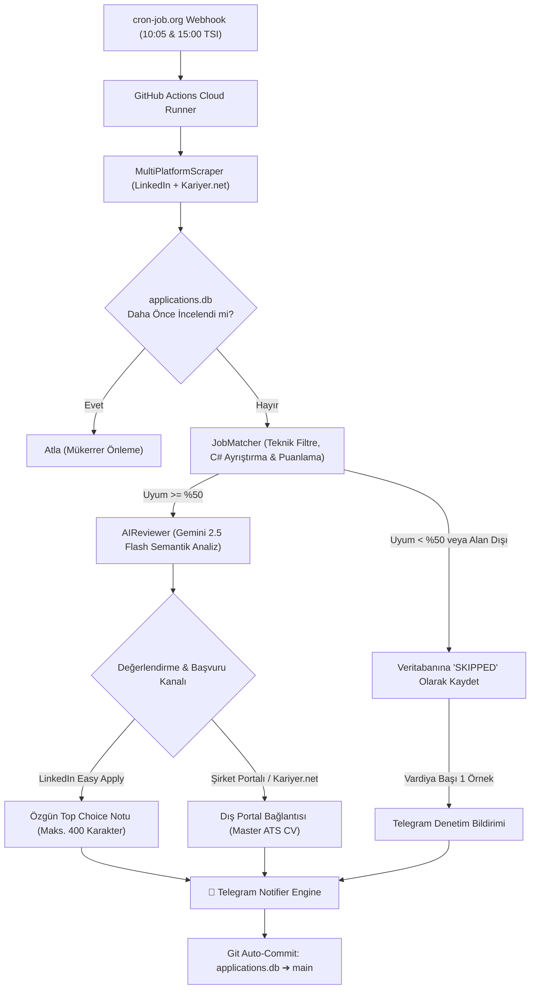

# 🚀 AI Career Copilot — Otonom İş Arama & Başvuru Asistanı

[](https://python.org)
[](https://aistudio.google.com/)
[](https://core.telegram.org/bots)
[-green.svg)](https://cron-job.org)
[](#)
[](#)

> **AI Career Copilot**, iş arama sürecini uçtan uca otomatikleştiren, **Google Gemini** bilişsel motoruyla güçlendirilmiş, sıfır halüsinasyon garantili ve bulut üzerinde 7/24 otonom çalışan yeni nesil bir kariyer asistanıdır.

Bilgisayarınız kapalıyken bile **LinkedIn** ve **Kariyer.net** üzerindeki tüm güncel ilanları tarar, adayın gerçek mühendislik projeleriyle (CoupleOS, 42 İstanbul C/C++ Sistem Mimarisi, branda.ist, NishChat vb.) semantik uyum analizi yapar, LinkedIn mobil Kolay Başvuru (Easy Apply) formuna özel **maksimum 400 karakterlik insan yazımı başvuru notları** üretir ve doğrudan Telegram üzerinden tek dokunuşla başvurabileceğiniz zengin kartlar iletir.

---

## 🌟 Öne Çıkan Yetenekler

* **🇹🇷 Çoklu Platform Taraması (LinkedIn + Kariyer.net):**
  * LinkedIn'in yanı sıra Türkiye'nin en büyük iş portalı olan **Kariyer.net** de paralel taranır.
  * Kariyer.net ilanları özel `🇹🇷 KARİYER.NET İLANI` rozeti ve doğrudan başvuru butonuyla Telegram'a iletilir.
* **🌊 Tam Kapsamlı Çift Dalga Tarama Mimarisi (10:05 & 15:00 TSI):**
  * İlan kategorileri yapay şekilde parçalanmaz; her çalışmada **TÜM KATEGORİLER** (Staj, C/C++, Backend, Frontend, Mobil, AI, IT Destek) taranır.
  * Sabah açılan ilan sabah 10:05'te, öğlen açılan ilan öğleden sonra 15:00'te yakalanır. İlanlar için 24 saatlik bekleme süresi ortadan kaldırılmıştır.
* **📍 Çoklu Lokasyon (İstanbul + Remote):**
  * Hem İstanbul yerelindeki fırsatlar hem de Türkiye geneli ve uzaktan (Remote) çalışma imkanları eksiksiz taranır.
* **🧠 Google Gemini 2.5 Flash & Dayanıklı Fallback Zinciri:**
  * İlan metninin tamamını (görevler, teknik gereksinimler) semantik olarak inceler.
  * Yüksek talep veya kota durumlarında otomatik olarak `gemini-flash-latest`, `gemini-2.5-pro` ve `gemini-2.5-flash-lite` fallback modellerine geçerek kesintisiz çalışır.
* **💬 LinkedIn Mobil Uyumlu Kolay Başvuru Notu (0-400 Karakter):**
  * LinkedIn mobil uygulamasındaki *"Başvurunuzla birlikte bir mesaj ekleyin (0/400)"* alanına özel üretilir.
  * Klasik "Sayın Yetkili" gibi hantal şablonlardan arındırılmış, doğrudan teknik katma değere odaklanan samimi mühendis dili.
  * Python seviyesinde kesin **$\le$ 400 karakter** uzunluk garantisi.
* **🎯 %100 Dürüst ve Sıkı Eşleşme Mantığı:**
  * `C#` / Unity oyun ilanlarının `C` diliyle çakışması önlenmiştir.
  * `.NET`, `iOS`, `Flutter`, `SAP` gibi alan dışı pozisyonlar doğrudan elenir.
  * Adayın portföyünden en az 1 teknik yetenek eşleşmedikçe ilan barajı geçemez.
* **⏱️ cron-job.org ile %100 Dakik Çalışma:**
  * GitHub Actions'ın geciken dahili cron kuyrukları devre dışı bırakılmıştır.
  * Tüm zamanlama `cron-job.org` üzerinden saniyesi saniyesine ve gecikmesiz yürütülür.
* **💾 Git Tabanlı Kalıcı Veritabanı:**
  * `applications.db` SQLite veritabanı her çalıştırmada otomatik commit edilir (`[skip ci]`). Mükerrer bildirim gönderilmez.

---

## 🏗️ Sistem Mimarisi



---

## 📂 Proje Dizin Yapısı

```text
├── .github/workflows/
│   └── daily_pipeline.yml       # cron-job.org uyumlu GitHub Actions iş akışı + DB Git commit adımı
├── config/
│   ├── master_profile.yaml      # Adayın tek gerçeklik kaynağı (%100 doğrulanmış portföy & yetenekler)
│   ├── application_rules.yaml   # Eşleşme kuralları, kıdem ve öncelik tanımları
│   ├── notifications.yaml       # Telegram bildirim şablonları ve format ayarları
│   └── search_criteria.yaml     # 14 odaklı arama sorgusu, lokasyonlar ve platform ayarları
├── core/
│   ├── ai_reviewer.py           # Gemini semantik analizi, fallback zinciri ve 400 karakterlik Easy Apply not üretimi
│   ├── db.py                    # SQLite bağlantı yönetimli ve çift kayıt önleyici DB motoru
│   ├── matcher.py               # Negatif unvan filtresi, C vs C# regex ve sıkı puanlama matematiği
│   ├── notifier.py              # Zengin Telegram HTML kartları, butonlar ve istatistik özeti
│   ├── scraper.py               # LinkedIn + Kariyer.net birleşik MultiPlatformScraper motoru
│   └── builder.py               # Master ATS CV eşleme motoru
├── source_resume/
│   └── Omer_Faruk_Gokdas_CV_Master_ATS.pdf  # 92 puanlık doğrulanmış tek sayfa ATS CV
├── tests/
│   ├── test_system.py           # Sistem temel bileşen testleri
│   └── test_redesign.py         # Çift dalga, regex ve filtreleme birim testleri
├── applications.db              # Canlı takip veritabanı (otomatik commit edilir)
├── run_automation.py            # Ana çalıştırma, CLI parametreleri ve vardiya orkestratörü
├── requirements.txt             # Python bağımlılıkları
└── README.md                    # Proje dokümantasyonu
```

---

## 🎯 Arama Kriterleri ve Taranan Roller

| Kategori | Taranan Anahtar Kelimeler | Hedef Platformlar |
| :--- | :--- | :--- |
| **Genç Yetenek & Staj** | `Software Engineering Intern`, `Genç Yetenek Yazılım`, `Junior Software Engineer` | LinkedIn + Kariyer.net |
| **C/C++ & Sistem** | `Junior C++ Developer`, `C++ Developer` | LinkedIn + Kariyer.net |
| **Backend & Veritabanı** | `Junior Backend Developer`, `Node.js Developer`, `NestJS Developer` | LinkedIn + Kariyer.net |
| **Frontend & Web & Mobil** | `Junior Frontend Developer`, `TypeScript Developer`, `React Native Developer` | LinkedIn + Kariyer.net |
| **Yapay Zeka & Altyapı** | `Junior AI Engineer`, `AI Developer`, `IT Support Specialist` | LinkedIn + Kariyer.net |

---

## 📱 Telegram Bildirim Formatı

Sistem Telegram üzerinden kullanıcıyı gereksiz bilgiyle boğmaz; doğrudan aksiyon aldırır:

1. **LinkedIn Kolay Başvuru (Easy Apply) Kartı:**
   * Uyum Puanı, Dil (TR/EN), Öne Çıkarılan Proje.
   * `💬 LinkedIn Başvuru Mesajı (Top Choice / 0-400 Karakter — Dokun Kopyala)`: Telefonda dokunulduğunda panoya kopyalanan hazır metin.
   * `[ 🚀 ⚡ Kolay Başvur (LinkedIn) ]` butonu.
2. **Kariyer.net Kartı:**
   * `🇹🇷 KARİYER.NET İLANI` rozeti.
   * `[ 🚀 🌐 Kariyer.net'te Başvur ]` butonu.
3. **Şirket Portalı / Dış Başvuru Kartı:**
   * `[ 🚀 🌐 Şirket Portalında Başvur ]` butonu.
4. **Denetim Kartı:**
   * `🚫 [ÖRNEK ELENEN İLAN — TEST/DENETİM]` ile botun hangi ilanları neden elediğini gösteren şeffaf geri bildirim.
5. **Tarama Özeti:**
   * Taranan yeni ilan, uygun bulunan ve elenen ilan sayıları.

---

## ⚡ Hızlı Başlangıç & Kurulum

### 1. Depoyu Klonlayın ve Bağımlılıkları Yükleyin

```bash
git clone https://github.com/omergokdass/ai-career-copilot.git
cd ai-career-copilot
python -m pip install -r requirements.txt
```

### 2. Ortam Değişkenlerini Ayarlayın

`.env` dosyanızı oluşturup API anahtarlarınızı tanımlayın:

```env
GEMINI_API_KEY=AQ.Ab8...SizinGeminiAnahtariniz
GEMINI_MODEL=gemini-2.5-flash

TELEGRAM_BOT_TOKEN=123456789:ABC...BotTokeniniz
TELEGRAM_CHAT_ID=6865745103
TELEGRAM_ENABLED=true
```

### 3. Yerel Test ve Çalıştırma

```bash
# Tüm kategorileri tam tarar (Türkiye saatine göre 1. veya 2. Dalga etiketi basar)
python run_automation.py --force

# Tüm birim testleri çalıştırın
python -m unittest discover tests
```

---

## 🔒 Güvenlik ve Gizlilik

* Hassas bilgiler (`.env`, bot tokenleri, API keyler) asla repoya commit edilmez.
* GitHub Actions ortamında tüm gizli değişkenler **GitHub Secrets** üzerinden güvenli biçimde enjekte edilir.
