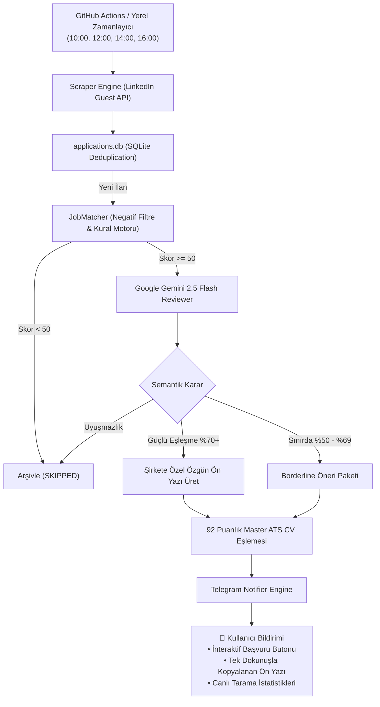

# 🚀 AI Career Copilot — Autonomous Job Hunter & Application Engine

[](https://python.org)
[](https://aistudio.google.com/)
[](https://core.telegram.org/bots)
[](https://github.com)
[](#)

> **AI Career Copilot**, iş arama ve başvuru sürecini uçtan uca otomatikleştiren, **Google Gemini 2.5 Flash** bilişsel motoru ile güçlendirilmiş, sıfır halüsinasyon garantili otonom bir kariyer asistanıdır.

LinkedIn ve kurumsal şirket portallarındaki açık pozisyonları sürekli tarar, adayın gerçek mühendislik projeleriyle semantik uyum puanı hesaplar, her şirket için %100 özgün ön yazılar (Cover Letter) üretir ve kullanıcının telefonuna **tek dokunuşla başvuru yapabileceği zengin Telegram kartları** iletir.

---

## 🌟 Öne Çıkan Özellikler

* **🧠 Google Gemini 2.5 Flash Bilişsel Motoru:** İlan metinlerini derinlemesine analiz ederek pozisyonun gerçek beklentilerini adayın doğrulanmış yetenek havuzuyla (42 İstanbul, Unix Sistem Programlama, C/C++, branda.ist, NishChat) kıyaslar ve semantik puan üretir.
* **🛡️ %100 Sıfır Halüsinasyon İlkesi:** Adayın master profilinde yer almayan hiçbir teknoloji veya şişirilmiş deneyim (Spring Boot, Redis, AWS vb.) yapay zeka tarafından uydurulamaz.
* **📱 Telegram Copilot Arayüzü:**
  * **İnteraktif Butonlar:** `[ 🚀 ⚡ Kolay Başvur (LinkedIn) ]` veya `[ 🚀 🌐 Şirket Portalında Başvur ]` düğmeleri ile ilana tek tıkla geçiş.
  * **Tek Dokunuşla Kopyalama (`<code>`):** Gemini tarafından yazılan şirket odaklı ön yazıya telefonda tek dokunuş yapıldığında metin anında panoya kopyalanır.
  * **Canlı İlerleme Sayacı:** Her mesajda günün toplam taranan ve uygun bulunan ilan sayıları gösterilir.
  * **Denetim Modu (Audit Cards):** Botun eleme mantığını test edebilmeniz için elenen ilanlardan örnek kartlar gerekçesiyle iletilir.
* **⏰ 4 Vardiyalı Dağıtım (Rate-Limit Koruması):** İlan aramaları günün en yoğun iş saatlerine (10:00, 12:00, 14:00, 16:00) bölünerek LinkedIn istek sınırları tamamen engellenir ve taze ilanlar anlık yakalanır.
* **📄 92 Puanlık Master ATS CV Entegrasyonu:** Tek sayfa A4, tipografik olarak optimize edilmiş uluslararası standarttaki ATS CV otomatik paketlenir.
* **🔒 Sıfır Ban Riski:** LinkedIn hesabınızı headless tarayıcı riskine atmadan, insan onaylı 5 saniyelik kontrollü başvuru modeli sunar.

---

## 🏗️ Sistem Mimarisi



---

## 📂 Proje Dizin Yapısı

```text
├── .github/workflows/
│   └── daily_pipeline.yml       # 4 vardiyalı otomatik GitHub Actions iş akışı
├── config/
│   ├── master_profile.yaml      # Adayın tek gerçeklik kaynağı (%100 doğrulanmış portföy)
│   ├── application_rules.yaml   # Başvuru ve güvenlik kuralları
│   ├── notifications.yaml       # Telegram bildirim ayarları
│   └── search_criteria.yaml     # 6 ana kategoride 30+ arama sorgusu
├── core/
│   ├── ai_reviewer.py           # Google Gemini 2.5 Flash semantik analiz ve ön yazı motoru
│   ├── db.py                    # SQLite bağlantı yönetimli başvuru takip veritabanı
│   ├── matcher.py               # Negatif filtre ve matematiksel ön eleme motoru
│   ├── notifier.py              # Zengin Telegram HTML, inline buton ve kopyalama motoru
│   ├── scraper.py               # LinkedIn parametreli ilan kazıyıcı
│   ├── builder.py               # ATS CV ve ön yazı derleyici
│   └── bot_apply.py             # Playwright Easy Apply tarayıcı yardımcısı
├── source_resume/
│   └── Omer_Faruk_Gokdas_CV_Master_ATS.pdf  # 92 puanlık doğrulanmış ana ATS CV
├── tests/
│   └── test_system.py           # 10 adet %100 geçen kapsamlı birim test paketi
├── run_automation.py            # Ana çalıştırma, vardiya ve orkestrasyon motoru
├── requirements.txt             # Python bağımlılıkları
├── .env.example                 # Ortam değişkenleri şablonu
└── README.md
```

---

## ⚡ Hızlı Başlangıç

### 1. Depoyu Klonlayın ve Bağımlılıkları Yükleyin

```bash
git clone https://github.com/omergokdass/ai-career-copilot.git
cd ai-career-copilot
python -m pip install -r requirements.txt
```

### 2. Ortam Değişkenlerini Ayarlayın

`.env.example` dosyasını `.env` olarak kopyalayın:

```bash
cp .env.example .env
```

`.env` dosyasını açıp API anahtarlarınızı girin:

```env
GEMINI_API_KEY=AIzaSy...SizinGeminiAnahtariniz
GEMINI_MODEL=gemini-2.5-flash

TELEGRAM_BOT_TOKEN=123456789:ABC...BotTokeniniz
TELEGRAM_CHAT_ID=6865745103
TELEGRAM_ENABLED=true
```

### 3. Sistemi Çalıştırın

```bash
# Otomatik saate göre vardiya çalıştır
python run_automation.py

# Tüm kategorileri hemen taramak için (Force mode)
python run_automation.py --force --all
```

---

## 🤖 GitHub Actions Otomasyonu (Bulutta 7/24)

Sistem, bilgisayarınız kapalıyken bile GitHub sunucularında her gün Türkiye saatiyle **10:00, 12:00, 14:00 ve 16:00'da** otomatik olarak çalışır.

GitHub deponuzda **Settings ➔ Secrets and variables ➔ Actions** sekmesine şu 3 secret'ı eklemeniz yeterlidir:
1. `GEMINI_API_KEY`
2. `TELEGRAM_BOT_TOKEN`
3. `TELEGRAM_CHAT_ID`

---

## 🧪 Testler

Sistemdeki 10 birim testin tamamı sıfır uyarı ve sıfır sızıntı garantisiyle çalışır:

```bash
python -m unittest tests/test_system.py
```

---

## 👤 Geliştirici ve İletişim

**Ömer Faruk Gökdaş**  
* Nişantaşı Üniversitesi — Yazılım Mühendisliği
* 42 İstanbul (Ecole 42) — Sistem Programlama
* LinkedIn: [linkedin.com/in/omergokdass](https://linkedin.com/in/omergokdass)
* GitHub: [github.com/omergokdass](https://github.com/omergokdass)
* Web: [omergokdass.github.io](https://omergokdass.github.io)
